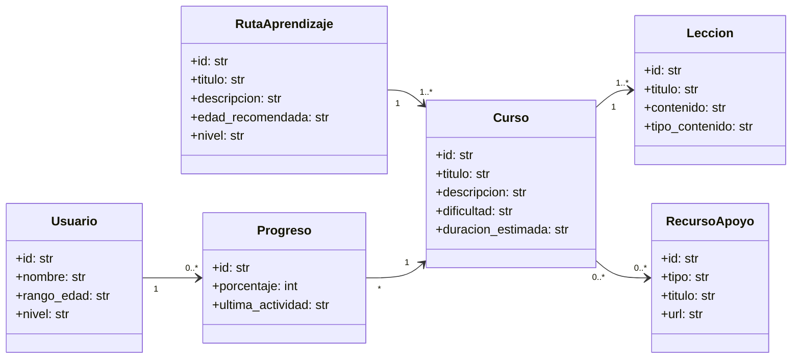

# Creciendo Juntos

Plataforma web de apoyo estudiantil con rutas de aprendizaje y recursos por edad.

## Introducción / Contexto

- Contexto académico: Proyecto integrador del 3er semestre de la Técnica en Desarrollo de Software.
- Problema: Muchas personas (niños, jóvenes y adultos) necesitan orientación y recursos para estudiar, pero la información suele estar dispersa, no siempre se adapta al nivel y puede ser difícil de seguir.
- Justificación: Centralizar rutas y apoyos estudiantiles facilita el aprendizaje autónomo, mejora hábitos de estudio y aporta una guía clara para avanzar paso a paso.

## Objetivos

*Objetivo General  
Diseñar e implementar un MVP en Streamlit que ofrezca rutas de aprendizaje y recursos de apoyo estudiantil, segmentados por edad y nivel.

Objetivos Específicos
- Levantar requisitos y definir perfiles de usuario (p. ej., estudiante y acudiente) y sus necesidades principales.
- Implementar un catálogo de rutas/cursos con filtros por rango de edad y nivel
(básico/intermedio).
- Desarrollar vistas de detalle para cursos y lecciones con contenido en texto y enlaces a recursos de apoyo.
- Implementar seguimiento básico: marcar lecciones como completadas y guardar favoritos/progreso con persistencia local.
- Documentar el proyecto (README + modelo de dominio v1) y dejar un flujo claro de ejecución local.

## Alcance del Proyecto (Scope)

Qué se va a desarrollar:
- Página de inicio con explicación del propósito y navegación a módulos.
- Módulo de rutas de aprendizaje (ej.: Matemáticas, Lectura, Inglés, Habilidades digitales).
- Módulo de cursos/lecciones con contenido tipo guía (texto) y recursos externos (enlaces).
- Segmentación simple por rango de edad (p. ej., 6–12 / 13–17 / 18+) y por nivel.
- Seguimiento básico (completado y favoritos) con guardado local (archivo JSON/CSV o SQLite local)
- Módulo de recursos de apoyo (técnicas de estudio, orientación, becas/convocatorias enlazadas, tutorías recomendadas).

Qué NO se va a desarrollar en esta versión (fuera de alcance):
- Pasarela de pagos, suscripciones, facturación o planes premium.
- Autenticación completa (contraseñas, recuperación, OAuth con Google, 2FA) y gestión avanzada de roles/permisos.
- Streaming/hosting propio de video (tipo “Platzi” con videos alojados y reproductor avanzado).
- Chat en tiempo real, videollamadas, tutorías en vivo o mensajería.
- Motor de recomendaciones con IA/ML (personalización automática por comportamiento).
- Despliegue productivo con arquitectura compleja (microservicios, Kubernetes) o analítica avanzada.
- App móvil nativa (Android/iOS) o notificaciones push.
- Base de datos en la nube y administración avanzada (en esta versión se prioriza persistencia local).

## Tecnologías y Herramientas (Tech Stack)

- Frontend: Streamlit (UI y navegación multipágina)
- Backend: Python 3.x
- Base de datos (futuro / opcional): PostgreSQL
- Otras herramientas: Git, GitHub, VS Code

## Integrantes del Equipo

| Nombre                                    | Rol principal                | Usuario GitHub                |
|-------------------------------------------|------------------------------|-------------------------------|
| [Daniel Martínez Echavarría]              | Líder                        | @DanielMartinez260906         |
| [Carolina Martínez Mesa]                  | Frontend                     | @caromm80                     |
| [Britany Alexandra Montoya Tirado]        | Base de datos                | @Britany-mon                  |
| [Brandon Cirto Ortíz]                     | Backend                      | @OBrandonC                    |
| [Samuel Hoyos Vanegas]                    | Backend                      | @SamuelH1211                  |

> Nota: reemplazar “(Completar)” y `@usuario` por los datos reales del equipo.

## Diagrama de Clases del Dominio (v1)

*Diagrama inicial del modelo de dominio (v1). Se actualizará en futuras entregas según el avance del proyecto.*

## Ejecución local (opcional)

1. Instalar dependencias: `pip install -r requirements.txt`
2. Ejecutar la app: `streamlit run Inicio.py`